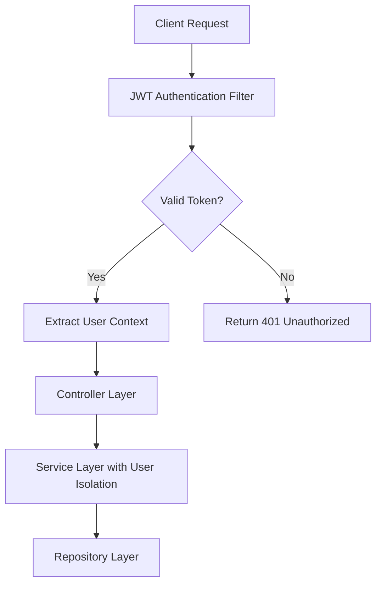

# Design Document

## Overview

The Personal Expense Tracker REST API is designed as a secure, scalable backend system built with Spring Boot 3.x and Java 17+. The system follows a layered architecture pattern with clear separation of concerns, implementing JWT-based authentication, comprehensive financial data management, and real-time analytics capabilities. The design prioritizes data security, financial precision, and RESTful API best practices.

## Architecture

### High-Level Architecture

The system follows a traditional 3-tier architecture:

```
┌─────────────────┐    ┌─────────────────┐    ┌─────────────────┐
│   Presentation  │    │    Business     │    │      Data       │
│     Layer       │    │     Layer       │    │     Layer       │
│                 │    │                 │    │                 │
│  Controllers    │◄──►│   Services      │◄──►│  Repositories   │
│  DTOs           │    │   Entities      │    │  Database       │
│  Security       │    │   Validation    │    │                 │
└─────────────────┘    └─────────────────┘    └─────────────────┘
```

### Technology Stack

- **Framework**: Spring Boot 3.x with Spring Security
- **Database**: H2 (development), PostgreSQL (production)
- **Authentication**: JWT with 24-hour expiration
- **Build Tool**: Maven
- **Testing**: JUnit 5, Mockito, TestContainers
- **Documentation**: OpenAPI 3 (Swagger UI)
### 
Security Architecture



## Components and Interfaces

### Core Entities

#### User Entity
```java
@Entity
@Table(name = "users")
public class User {
    @Id
    @GeneratedValue(strategy = GenerationType.IDENTITY)
    private Long id;
    
    @Column(unique = true, nullable = false)
    private String email;
    
    @Column(nullable = false)
    private String password; // BCrypt encrypted
    
    @Column(nullable = false)
    private String name;
    
    @CreationTimestamp
    private LocalDateTime createdAt;
    
    @UpdateTimestamp
    private LocalDateTime updatedAt;
    
    @OneToMany(mappedBy = "user", cascade = CascadeType.ALL)
    private List<Account> accounts;
}
```

#### Account Entity
```java
@Entity
@Table(name = "accounts")
public class Account {
    @Id
    @GeneratedValue(strategy = GenerationType.IDENTITY)
    private Long id;
    
    @Column(nullable = false)
    private String name;
    
    @Enumerated(EnumType.STRING)
    @Column(nullable = false)
    private AccountType type; // CHECKING, SAVINGS, CREDIT, INVESTMENT
    
    @Column(precision = 19, scale = 2)
    private BigDecimal initialBalance;
    
    @Column(nullable = false)
    private boolean deleted = false;
    
    @ManyToOne(fetch = FetchType.LAZY)
    @JoinColumn(name = "user_id", nullable = false)
    private User user;
    
    @OneToMany(mappedBy = "account", cascade = CascadeType.ALL)
    private List<Transaction> transactions;
}
```#### T
ransaction Entity
```java
@Entity
@Table(name = "transactions")
public class Transaction {
    @Id
    @GeneratedValue(strategy = GenerationType.IDENTITY)
    private Long id;
    
    @Column(nullable = false, precision = 19, scale = 2)
    private BigDecimal amount; // Positive for income, negative for expenses
    
    @Column(nullable = false)
    private String description;
    
    @Column(nullable = false)
    private LocalDate transactionDate;
    
    @ManyToOne(fetch = FetchType.LAZY)
    @JoinColumn(name = "account_id", nullable = false)
    private Account account;
    
    @ManyToOne(fetch = FetchType.LAZY)
    @JoinColumn(name = "category_id", nullable = false)
    private Category category;
    
    @Column(nullable = false)
    private boolean deleted = false;
    
    @CreationTimestamp
    private LocalDateTime createdAt;
    
    @UpdateTimestamp
    private LocalDateTime updatedAt;
}
```

#### Category Entity
```java
@Entity
@Table(name = "categories")
public class Category {
    @Id
    @GeneratedValue(strategy = GenerationType.IDENTITY)
    private Long id;
    
    @Column(nullable = false)
    private String name;
    
    @Column
    private String description;
    
    @Column(nullable = false)
    private boolean isDefault = false; // For "Uncategorized"
}
```

### Service Layer Design

#### UserService
- **Responsibilities**: User registration, authentication, profile management
- **Key Methods**:
  - `registerUser(UserRegistrationRequest)`: Creates new user with encrypted password
  - `authenticateUser(LoginRequest)`: Validates credentials and returns JWT
  - `getUserById(Long)`: Retrieves user by ID with security context validation

#### AccountService
- **Responsibilities**: Account CRUD operations, balance calculations
- **Key Methods**:
  - `createAccount(CreateAccountRequest, Long userId)`: Creates new account for user
  - `getUserAccounts(Long userId)`: Returns user's accounts with calculated balances
  - `updateAccount(Long accountId, UpdateAccountRequest, Long userId)`: Updates account with ownership validation
  - `softDeleteAccount(Long accountId, Long userId)`: Soft deletes account if no active transactions
  - `calculateAccountBalance(Long accountId)`: Sums all non-deleted transactions##
## TransactionService
- **Responsibilities**: Transaction management, categorization, audit trail
- **Key Methods**:
  - `createTransaction(CreateTransactionRequest, Long userId)`: Creates transaction with validation
  - `updateTransaction(Long transactionId, UpdateTransactionRequest, Long userId)`: Updates with audit trail
  - `getUserTransactions(Long userId, TransactionFilter)`: Retrieves filtered transactions
  - `softDeleteTransaction(Long transactionId, Long userId)`: Soft deletes transaction

#### AnalyticsService
- **Responsibilities**: Financial calculations, reporting, trend analysis
- **Key Methods**:
  - `getMonthlySpendingSummary(Long userId, YearMonth)`: Calculates income, expenses, savings
  - `getSpendingByCategory(Long userId, DateRange)`: Groups expenses by category
  - `calculateSavingsRate(Long userId, DateRange)`: Computes savings percentage
  - `getTrendAnalysis(Long userId, DateRange)`: Provides month-over-month comparisons

### Controller Layer Design

#### REST API Endpoints

**Authentication Endpoints**
- `POST /api/v1/auth/register` - User registration
- `POST /api/v1/auth/login` - User authentication

**Account Management**
- `GET /api/v1/accounts` - List user accounts
- `POST /api/v1/accounts` - Create new account
- `PUT /api/v1/accounts/{id}` - Update account
- `DELETE /api/v1/accounts/{id}` - Soft delete account
- `GET /api/v1/accounts/{id}/balance` - Get calculated balance

**Transaction Management**
- `GET /api/v1/transactions` - List transactions with filtering
- `POST /api/v1/transactions` - Create transaction
- `PUT /api/v1/transactions/{id}` - Update transaction
- `DELETE /api/v1/transactions/{id}` - Soft delete transaction

**Analytics**
- `GET /api/v1/analytics/monthly-summary` - Monthly spending summary
- `GET /api/v1/analytics/spending-by-category` - Category breakdown
- `GET /api/v1/analytics/savings-rate` - Savings rate calculation
- `GET /api/v1/analytics/trends` - Trend analysis

## Data Models

### Request/Response DTOs

#### Authentication DTOs
```java
public class UserRegistrationRequest {
    @NotBlank @Email
    private String email;
    
    @NotBlank @Size(min = 8)
    private String password;
    
    @NotBlank
    private String name;
}

public class LoginRequest {
    @NotBlank @Email
    private String email;
    
    @NotBlank
    private String password;
}

public class AuthResponse {
    private String token;
    private String tokenType = "Bearer";
    private Long expiresIn = 86400L; // 24 hours
    private UserResponse user;
}
```#### 
Account DTOs
```java
public class CreateAccountRequest {
    @NotBlank
    private String name;
    
    @NotNull
    private AccountType type;
    
    @DecimalMin("0.00")
    private BigDecimal initialBalance;
}

public class AccountResponse {
    private Long id;
    private String name;
    private AccountType type;
    private BigDecimal currentBalance;
    private LocalDateTime createdAt;
}
```

#### Transaction DTOs
```java
public class CreateTransactionRequest {
    @NotNull @DecimalMin("0.01")
    private BigDecimal amount;
    
    @NotBlank
    private String description;
    
    private LocalDate transactionDate; // Defaults to today
    
    @NotNull
    private Long accountId;
    
    private Long categoryId; // Defaults to "Uncategorized"
    
    @NotNull
    private TransactionType type; // INCOME or EXPENSE
}

public class TransactionResponse {
    private Long id;
    private BigDecimal amount;
    private String description;
    private LocalDate transactionDate;
    private AccountResponse account;
    private CategoryResponse category;
    private TransactionType type;
    private LocalDateTime createdAt;
}
```

## Error Handling

### Global Exception Handler

```java
@ControllerAdvice
public class GlobalExceptionHandler {
    
    @ExceptionHandler(ResourceNotFoundException.class)
    public ResponseEntity<ErrorResponse> handleResourceNotFound(ResourceNotFoundException ex) {
        ErrorResponse error = ErrorResponse.builder()
            .timestamp(LocalDateTime.now())
            .status(HttpStatus.NOT_FOUND.value())
            .error("Resource Not Found")
            .message(ex.getMessage())
            .build();
        return ResponseEntity.status(HttpStatus.NOT_FOUND).body(error);
    }
    
    @ExceptionHandler(ValidationException.class)
    public ResponseEntity<ErrorResponse> handleValidation(ValidationException ex) {
        ErrorResponse error = ErrorResponse.builder()
            .timestamp(LocalDateTime.now())
            .status(HttpStatus.BAD_REQUEST.value())
            .error("Validation Error")
            .message(ex.getMessage())
            .details(ex.getValidationErrors())
            .build();
        return ResponseEntity.badRequest().body(error);
    }
}
```#
# Testing Strategy

### Unit Testing Approach

1. **Service Layer Tests**: Mock repository dependencies, test business logic
2. **Controller Tests**: Use `@WebMvcTest`, mock service dependencies
3. **Repository Tests**: Use `@DataJpaTest` with test database
4. **Integration Tests**: Use `@SpringBootTest` with TestContainers

### Test Coverage Requirements

- **Service Classes**: 90%+ coverage including edge cases
- **Controller Classes**: 85%+ coverage including error scenarios
- **Repository Classes**: Basic CRUD and custom query testing
- **Security Components**: Authentication and authorization flows

### Sample Test Structure

```java
@ExtendWith(MockitoExtension.class)
class AccountServiceTest {
    
    @Mock
    private AccountRepository accountRepository;
    
    @Mock
    private UserRepository userRepository;
    
    @InjectMocks
    private AccountService accountService;
    
    @Test
    void createAccount_ValidRequest_ReturnsAccountResponse() {
        // Given
        CreateAccountRequest request = new CreateAccountRequest();
        request.setName("Test Account");
        request.setType(AccountType.CHECKING);
        
        User user = new User();
        user.setId(1L);
        
        Account savedAccount = new Account();
        savedAccount.setId(1L);
        savedAccount.setName("Test Account");
        
        when(userRepository.findById(1L)).thenReturn(Optional.of(user));
        when(accountRepository.save(any(Account.class))).thenReturn(savedAccount);
        
        // When
        AccountResponse response = accountService.createAccount(request, 1L);
        
        // Then
        assertThat(response.getName()).isEqualTo("Test Account");
        verify(accountRepository).save(any(Account.class));
    }
}
```

This design provides a robust, secure, and scalable foundation for the Personal Expense Tracker API, addressing all requirements while following Spring Boot best practices and ensuring financial data precision and security.